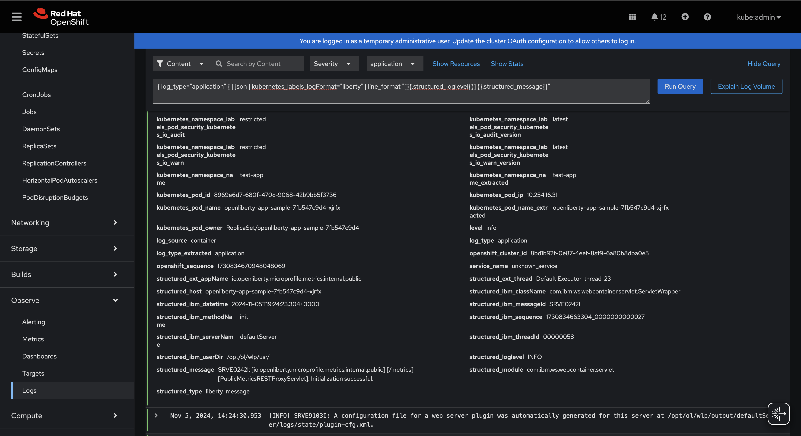

# Application Logging on Red Hat OpenShift Container Platform (RHOCP) with Loki, Vector, and the RHOCP Cluster Observability Operator

The following guide has been tested and is supported with Red Hat OpenShift Container Platform (RHOCP) version 4.17.

Pod processes running in Kubernetes frequently produce logs. To effectively manage this log data and ensure no loss of log data occurs when a pod terminates, a log aggregation tool should be deployed on the Kubernetes cluster. Log aggregation tools help users persist, search, and visualize the log data that is gathered from the pods across the cluster. Log aggregation tools in the market today include:  EFK, LogDNA, Splunk, Datadog, IBM Operations Analytics, etc.  When considering log aggregation tools, enterprises make choices that are inclusive of their journey to cloud, both new cloud-native applications running in Kubernetes and their existing traditional IT choices.

With the release of Logging 6.0 in RHOCP 4.17, the EFK stack is no longer supported. Logging 6.0 now manages log storage, collection, and visualization using Loki, Vector, and the Cluster Observability's new Logging UI Plugin. This guide describes the process of deploying the new stack using the Loki, RedHat OpenShift Logging, and Cluster Observability Operators. Use this stack to aggregate all container logs. After a successful installation, the Loki and log collector pods should reside inside the *openshift-logging* namespace of the cluster. Check out this link:++https://docs.openshift.com/container-platform/4.17/observability/logging/logging-6.0/log6x-upgrading-to-6.html[doc] for more information on the new changes introduced in Logging 6.0.

## Setup LokiStack and Cluster Log Forwarding 

Follow this link:++https://docs.openshift.com/container-platform/4.17/observability/logging/logging-6.0/log6x-about.html#quick-start[guide] to set up LokiStack and a ClusterLogForwarder in the `openshift-logging` namespace.

After the LokiStack and ClusterLogForwarder deployments are completed, you should see the following pods running in the openshift-logging namespace.

[source,sh]
----
logging-loki-compactor-0                       1/1     Running   0          3h45m
logging-loki-distributor-74cb8f8854-5fr9t      1/1     Running   0          3h45m
logging-loki-distributor-74cb8f8854-p88cx      1/1     Running   0          3h45m
logging-loki-gateway-78888d6c56-428w9          2/2     Running   0          3h45m
logging-loki-gateway-78888d6c56-6wl5b          2/2     Running   0          3h45m
logging-loki-index-gateway-0                   1/1     Running   0          3h45m
logging-loki-index-gateway-1                   1/1     Running   0          3h45m
logging-loki-ingester-0                        1/1     Running   0          3h45m
logging-loki-ingester-1                        1/1     Running   0          3h44m
logging-loki-querier-57c8bd8c75-vcc4t          1/1     Running   0          3h45m
logging-loki-querier-57c8bd8c75-wwlrd          1/1     Running   0          3h45m
logging-loki-query-frontend-6bbb599859-rmsmk   1/1     Running   0          3h45m
logging-loki-query-frontend-6bbb599859-zhcfj   1/1     Running   0          3h45m
cluster-logging-operator-7b6bc9c48-2mjx2       1/1     Running   0          4h22m
collector-59dxs                                1/1     Running   0          3h16m
collector-7p6h7                                1/1     Running   0          3h16m
collector-jbwkn                                1/1     Running   0          3h16m
collector-ntzm4                                1/1     Running   0          3h16m
collector-vzlm4                                1/1     Running   0          3h16m
collector-z75z5                                1/1     Running   0          3h16m
----

## Tips

You can configure LokiStack and the CustomLogForwarder according to your needs. Check out this link:https://docs.openshift.com/container-platform/4.17/observability/logging/logging-6.0/log6x-loki.html[doc] for how to configure LokiStack storage, and this link:https://docs.openshift.com/container-platform/4.17/observability/logging/logging-6.0/log6x-clf.html[doc] for how to configure log fowarding.

### Object storage

You must have existing object storage in order to configure LokiStack. Loki Operator supports AWS S3, Azure, GCS, Minio, OpenShift Data Foundation, and Swift as options for LokiStack object storage.

Create a secret `logging-loki-s3` inside the `openshift-logging` namespace that contains the required fields needed for LokiStack to access your object storage. As an example, the command below creates a secret that allows access to an OpenShift Data Foundation managed S3 bucket running inside the cluster.

[source,sh]
----
  oc create secret generic logging-loki-s3 \
    --from-literal=access_key_id=key \
    --from-literal=access_key_secret=secret \
    --from-literal=bucketnames=bucket-name \
    --from-literal=endpoint=endpoint \
    --namespace openshift-logging
----

### Parsing JSON logs

By default, if container logs are being output in JSON format, they will be nested inside the Vector JSON document's message field. To solve this problem, add the following YAML to the ClusterLogForwarder CR you created earlier:

[source,yaml]
----
 kind: ClusterLogForwarder
 spec:
   ...
   filterRefs:
   - parse-json
   ...
   pipelines:
   - name: default-logstore
     ...
     filters:
     - name: parse-json
       type: parse
----
The addition of the JSON filter above will copy the nested JSON container log into a separate `structured` field inside the Vector JSON document, where the individual fields from the JSON container log can be accessed as `structured. <field_name>`.

## Visualizing your logs using the Cluster Observability Operator's Logging UI Plugin

. Add the label `logFormat: liberty` to your OpenLibertyApplication Custom Resource. We will use this label to filter for your application pod logs in Observe > Logs.
+
[source,yaml]
----
kind: OpenLibertyApplication
apiVersion: v1
metadata:
  name: <your-liberty-app>
  labels:
    logFormat: liberty
....
----

. In your OCP web console, go to Observe > Logs to see your application logs.
+

. Use the following LogQL query to filter for and format your application pod logs.
+
[source, text]
----
{ log_type="application" } | json | kubernetes_labels_logFormat="liberty" | line_format "[{{.structured_loglevel}}] {{.structured_message}}"
----

. To see additional `structured.*` formatted individual fields from your application pod log, expand a log entry.
+

## Installation Complete

You can now ingest, forward, and view your application logs using LokiStack, Vector, and the Cluster Observability Operator's Logging UI Plugin.
