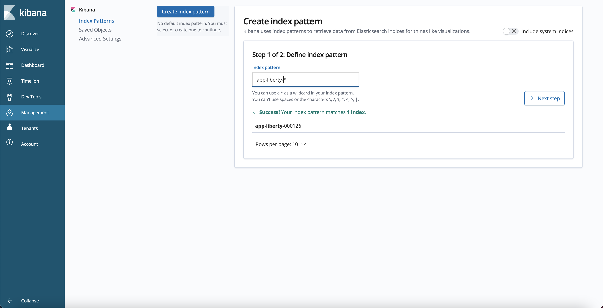
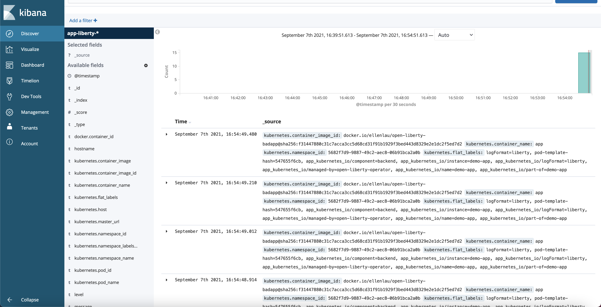
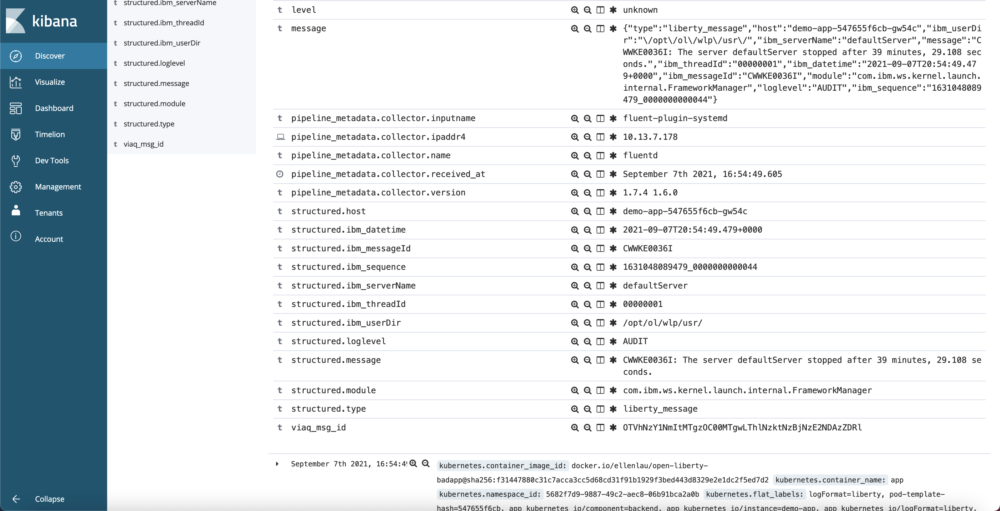
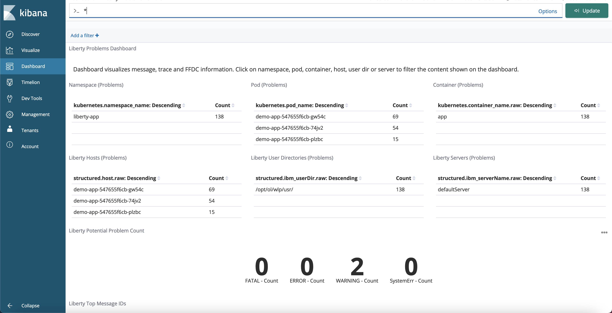

# Application Logging on Red Hat OpenShift Container Platform (RHOCP) with Elasticsearch, Fluentd, and Kibana 

The following guide has been tested and is supported with Red Hat OpenShift Container Platform (RHOCP) versions 4.12, 4.14, 4.15, and 4.16.

Pod processes running in Kubernetes frequently produce logs. To effectively manage this log data and ensure no loss of log data occurs when a pod terminates, a log aggregation tool should be deployed on the Kubernetes cluster. Log aggregation tools help users persist, search, and visualize the log data that is gathered from the pods across the cluster. Log aggregation tools in the market today include:  EFK, LogDNA, Splunk, Datadog, IBM Operations Analytics, etc.  When considering log aggregation tools, enterprises make choices that are inclusive of their journey to cloud, both new cloud-native applications running in Kubernetes and their existing traditional IT choices.

One choice for application logging with log aggregation, based on open source, is **EFK (Elasticsearch, Fluentd, and Kibana)**. This guide describes the process of deploying EFK using the Elasticsearch Operator and the Red Hat Openshift Logging Operator. Use this preconfigured EFK stack to aggregate all container logs. After a successful installation, the EFK pods should reside inside the *openshift-logging* namespace of the cluster.

## Install Openshift Logging

To install the Openshift Logging component, follow the OpenShift guide  link:++https://docs.openshift.com/container-platform/4.16/observability/logging/cluster-logging-deploying.html++[Installing Openshift Logging]. OpenShift now provides two log store options: the OpenShift Elasticsearch Operator (that is used in this guide) and the Loki Operator. Before deploying the example Cluster Logging instance YAML in the guide, install the OpenShift Elasticsearch Operator into all namespaces in your cluster.

Ensure you set up valid storage for Elasticsearch via Persistent Volumes. When the example Cluster Logging instance YAML from the guide is deployed, the Elasticsearch pods that are created automatically search for Persistent Volumes to bind to; if there are none available for binding, the Elasticsearch pods are stuck in a pending state. Using in-memory storage is also possible by removing the `storage` definition from the Openshift Logging instance YAML, but this is not suitable for production.

After the installation completes without any error, you can see the following pods that are running in the *openshift-logging* namespace. The exact number of pods running for each of the EFK components can vary depending on the configuration specified in the ClusterLogging Custom Resource (CR).

[source,sh]
----
oc get pods -n openshift-logging

NAME                                            READY   STATUS      RESTARTS   AGE
cluster-logging-operator-669bb88bf8-6j9zf       1/1     Running     0          133m
collector-2d5fq                                 2/2     Running     0          25m
collector-5hsgz                                 2/2     Running     0          25m
collector-mws4s                                 2/2     Running     0          25m
collector-t28v8                                 2/2     Running     0          25m
collector-zc6qg                                 2/2     Running     0          25m
collector-zzxvx                                 2/2     Running     0          25m
elasticsearch-cdm-c8x3gk9d-1-b76f5dd96-8krft    2/2     Running     0          132m
elasticsearch-cdm-c8x3gk9d-2-8694c44b8d-tr5ft   2/2     Running     0          132m
elasticsearch-cdm-c8x3gk9d-3-765789d49b-w5zwd   2/2     Running     0          132m
elasticsearch-im-app-27922890-2blts             0/1     Completed   0          8m33s
elasticsearch-im-audit-27922890-jskjs           0/1     Completed   0          8m33s
elasticsearch-im-infra-27922890-59jqn           0/1     Completed   0          8m33s
kibana-79ccc8fd87-ns6xn                         2/2     Running     0          132m
----

The Openshift Logging instance also exposes a route for external access to the Kibana console.

[source,sh]
----
oc get routes -n openshift-logging

NAME     HOST/PORT                                               PATH   SERVICES   PORT    TERMINATION          WILDCARD
kibana   kibana-openshift-logging.host.com                kibana     <all>   reencrypt/Redirect   None
----

## Parsing JSON Container Logs

In OpenShift, the OpenShift Logging Fluentd collectors capture the application container logs and set each log into a message field of a Fluentd JSON document. If the logs are being output in JSON format, then they will be nested inside the the Fluentd JSON document's message field. In order to properly utilize the JSON log data inside a Kibana dashboard, the individual fields inside the nested JSON logs must be parsed out. 

Starting from RHOCP 4.7, the ability to parse these nested JSON application container logs has been provided with the additional deployment of a Cluster Log Forwarder instance. Once deployed, the configured Cluster Log Forwarder instance will copy the nested JSON log into a separate `structured` field inside the Fluentd JSON document, where the individual fields from the JSON container log can be accessed as `structured.<field_name>`.

In order to avoid the possibility of conflicting JSON fields, where different products or applications may use the same JSON field names to represent different data types, the Cluster Log Forwarder instance requires JSON container logs from different application/product types to be separated into unique indices. In the following instructions, the ClusterLogForwarder Custom Resource (CR) will create these unique indices using a label attached to the service of your application.

First, add the label `logFormat: liberty` to your OpenLibertyApplication Custom Resource. The Cluster Log Forwarder instance will use this label later to create a unique index for the container's application logs.

[source,yaml]
----
kind: OpenLibertyApplication
apiVersion: v1
metadata:
  name: <your-liberty-app>
  labels:
    logFormat: liberty
....
----

Restart your application deployment to include the updated label in your application's service and pod.

Create the following YAML file `cluster-logging-forwarder.yaml` to configure a Cluster Log Forwarder instance that will parse your JSON container logs.

[source,yaml]
----
apiVersion: logging.openshift.io/v1
kind: ClusterLogForwarder
metadata:
  namespace: openshift-logging
  name: instance
spec:
  inputs:
    - name: liberty-logs
      application:
        namespaces:
          - liberty-app   #modify this value to be your own app namespace
  outputDefaults:
    elasticsearch:
      structuredTypeKey: kubernetes.labels.logFormat
      structuredTypeName: nologformat
  outputs:
  pipelines:
    - name: parse-liberty-json
      inputRefs:
        - liberty-logs
      outputRefs:
        - default
      parse: json
----

The YAML above sets up a new ClusterLogForwarder pipeline `parse-liberty-json`. This pipeline takes in an input of `liberty_logs`, all the container logs from the `liberty-app` namespace, and outputs them to the OpenShift cluster's default Elasticsearch log store. The `parse: json` definition enables the JSON log parsing.

The configured `outputDefaults.elasticsearch.structuredTypeKey` parameter will build a unique index for the container logs by prepending `app-` to the value of the `logFormat` label in the container. Previously, the label `logFormat: liberty` was added to the service of your OpenLibertyApplication, so the logs forwarded to the Elasticsearch default log store can be found under an index pattern of `app-liberty-*`. If no `logFormat` label exists in your application container, the `outputDefaults.elasticsearch.structuredTypeName` parameter provides a fallback index name.

Deploy the Cluster Log Forwarder instance with the following command:

[source,sh]
----
oc create -f cluster-logging-forwarder.yaml
----

For more information on parsing JSON logs in RHOCP, see the the OpenShift guide link:++https://docs.openshift.com/container-platform/4.16/observability/logging/log_collection_forwarding/cluster-logging-enabling-json-logging.html++[Enabling JSON logging].

## View application logs in Kibana

In cases where the application server provides the option, output application logs in JSON format. This lets you fully take advantage of Kibana's dashboard functions. Kibana is then able to process the data from each individual field of the JSON object to create customized visualizations for that field.

View the Kibana dashboard by using the Kibana route URL found at:  

[source,sh]
----
oc get routes -n openshift-logging
----

Log in using your Kubernetes user and password. The browser will redirect you to Kibana's **Create index pattern** page under **Management**. Create a new index pattern **app-liberty-*** (that was defined above) to select all the Elasticsearch indices used for your Liberty application logs. In the next step, select the `@timestamp`, as the Time Filter field name, and click **Create index pattern**. Navigate to the **Discover** page to view the application logs generated by the deployed application.

image::images/app-logging-ocp-index-pattern-time-field-4.7.png[Select time field for the new index pattern in Kibana 7]

Expand an individual log entry to see the `structured.*` formatted individual fields, parsed and copied out of the nested JSON log entry.

Kibana dashboards created for Open Liberty logging events can be found link:++https://github.com/OpenLiberty/open-liberty-operator/tree/main/deploy/dashboards/logging++[here]. To import a dashboard and its associated objects, navigate back to the **Management** page and click **Saved Objects**. Click **Import** and select the dashboard file. When prompted, click the **Yes, overwrite all** option. If there are Index Pattern Conflicts, ensure to select the newly created index pattern **app-liberty-*** for the saved objects, and click **Confirm all changes**.

Head back to the **Dashboard** page and enjoy navigating logs on the newly imported dashboard.

## Configuring and uninstalling Openshift Logging

If changes must be made for the installed EFK stack, edit the ClusterLogging Custom Resource (CR) of the deployed Openshift Logging instance. If the EFK stack is no longer needed, remove the Openshift Logging instance from the Red Hat Openshift Logging Operator Details page.
