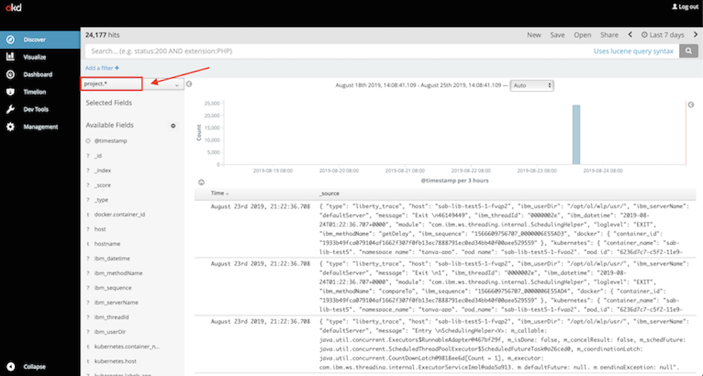
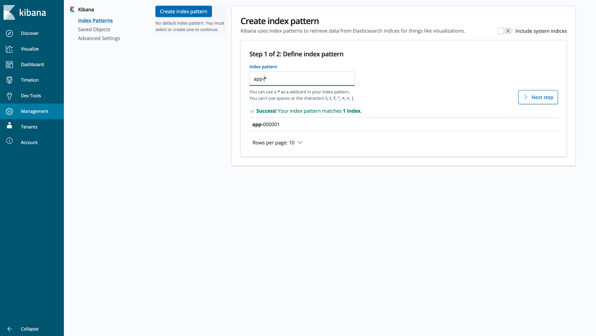
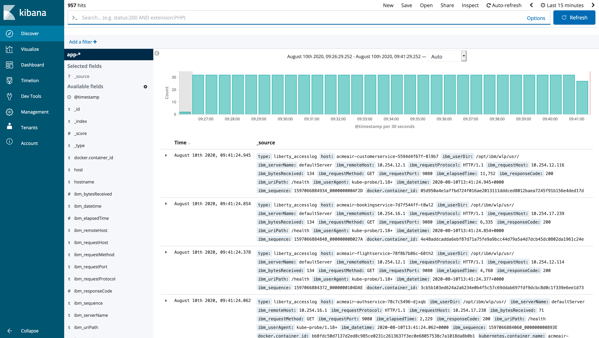
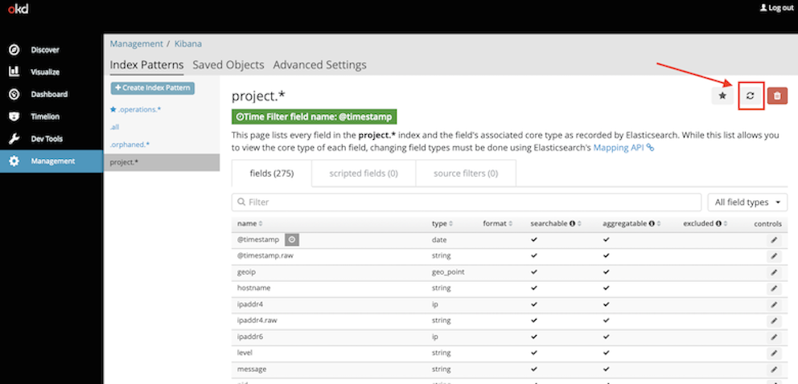
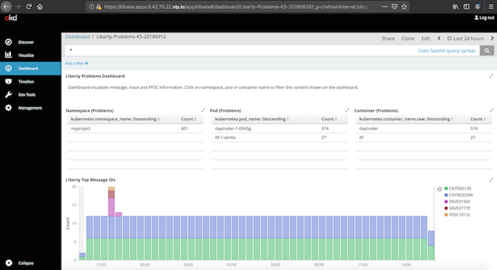

# Application Logging on Red Hat OpenShift Container Platform (RHOCP) with Elasticsearch, Fluentd, and Kibana 

The following guide has been tested with Red Hat OpenShift Container Platform (RHOCP) 4.2, 4.3, 4.4, 4.5, 4.6 and 4.7.

Pod processes running in Kubernetes frequently produce logs. To effectively manage this log data and ensure no loss of log data occurs when a pod terminates, a log aggregation tool should be deployed on the Kubernetes cluster. Log aggregation tools help users persist, search, and visualize the log data that is gathered from the pods across the cluster. Log aggregation tools in the market today include:  EFK, LogDNA, Splunk, Datadog, IBM Operations Analytics, etc.  When considering log aggregation tools, enterprises make choices that are inclusive of their journey to cloud, both new cloud-native applications running in Kubernetes and their existing traditional IT choices.

One choice for application logging with log aggregation, based on open source, is **EFK (Elasticsearch, Fluentd, and Kibana)**. This guide describes the process of deploying EFK using the Elasticsearch Operator and the OpenShift Logging Operator. Use this preconfigured EFK stack to aggregate all container logs. After a successful installation, the EFK pods should reside inside the *openshift-logging* namespace of the cluster.

## Install OpenShift Logging

To install the OpenShift Logging component, follow the OpenShift guide  link:++https://docs.openshift.com/container-platform/4.7/logging/cluster-logging-deploying.html++[Installing OpenShift Logging]. Ensure you set up valid storage for Elasticsearch via Persistent Volumes. When the example OpenShift Logging instance YAML from the guide is deployed, the Elasticsearch pods that are created automatically search for Persistent Volumes to bind to; if there are none available for binding, the Elasticsearch pods are stuck in a pending state. Using in-memory storage is also possible by removing the `storage` definition from the OpenShift Logging instance YAML, but this is not suitable for production.

After the installation completes without any error, you can see the following pods that are running in the *openshift-logging* namespace. The exact number of pods running for each of the EFK components can vary depending on the configuration specified in the ClusterLogging Custom Resource (CR).

[source,sh]
----
[root@rhel7-ocp ~]# oc get pods -n openshift-logging

NAME                                            READY   STATUS      RESTARTS   AGE
cluster-logging-operator-874597bcb-qlmlf        1/1     Running     0          150m
curator-1578684600-2lgqp                        0/1     Completed   0          4m46s
elasticsearch-cdm-4qrvthgd-1-5444897599-7rqx8   2/2     Running     0          9m6s
elasticsearch-cdm-4qrvthgd-2-865c6b6d85-69b4r   2/2     Running     0          8m3s
fluentd-rmdbn                                   1/1     Running     0          9m5s
fluentd-vtk48                                   1/1     Running     0          9m5s
kibana-756fcdb7f-rw8k8                          2/2     Running     0          9m6s
----

The OpenShift Logging also exposes a route for external access to the Kibana console.

[source,sh]
----
[root@rhel7-okd ~]# oc get routes -n openshift-logging

NAME     HOST/PORT                                               PATH   SERVICES   PORT    TERMINATION          WILDCARD
kibana   kibana-openshift-logging.apps.host.kabanero.com                kibana     <all>   reencrypt/Redirect   None
----

## Configure Fluentd to merge JSON log message body

In OpenShift, the OpenShift Logging Fluentd collectors capture the container logs and set each log into a message field of a Fluentd JSON document. This JSON is sent to their destination log consumer. To properly use JSON log data in a dashboard, you must configure the Fluentd collectors to merge nested JSON data to the parent JSON payload. Enabling Fluentd to merge JSON logs can cause problems if JSON fields from different products or applications use the same JSON field names to represent different data types. These problems occur because Elasticsearch uses the first occurrence of a field to determine the data types corresponding to that field name. If multiple deployments generate JSON logs with the same fields, but are of different data types, merging the JSON data can potentially lead to data loss in your Elasticsearch index. Review your OpenShift configuration to determine whether the potential impact poses a risk to your environment. The following steps are required to enable merging of nested JSON fields.

First, set the OpenShift Logging instance's **managementState** field from **"Managed"** to **"Unmanaged"**. Setting the OpenShift Logging instance to unmanaged state gives the administrator full control of the components managed by the OpenShift Logging Operator, and is the prerequisite for many OpenShift Logging configurations.

[source,yaml]
----
[root@rhel7-ocp ~]# oc edit ClusterLogging instance

apiVersion: "logging.openshift.io/v1"
kind: "ClusterLogging"
metadata:
  name: "instance"

....

spec:
  managementState: "Unmanaged"
----

To parse the JSON fields from the message body and merge the parsed objects with the JSON payload document posted to Elasticsearch, the **merge_json_log** variable referenced in fluentd's configmap must be set to true (it is false by default).

If you are using **RHOCP 4.2-4.5**, this can be done using the environment variable **MERGE_JSON_LOG**. Set **MERGE_JSON_LOG** to **true** with the following command:

[source,yaml]
----
[root@rhel7-ocp ~]# oc set env ds/fluentd MERGE_JSON_LOG=true
----
In **RHOCP 4.6+**, the environment variable **MERGE_JSON_LOG** has been disabled, so you must manually edit the fluentd configmap to set **merge_json_log** to **true**.

Edit the fluentd configmap with the following command:

[source,yaml]
----
[root@rhel7-ocp ~]# oc edit configmap fluentd
----
In the configmap, change the values of **merge_json_log** to be **true**:

[source,yaml]
----
...
  <filter kubernetes.journal.**>
    @type parse_json_field
    merge_json_log 'true'      #this line should be true
    preserve_json_log 'true'
    json_fields 'log,MESSAGE'
  </filter>

  <filter kubernetes.var.log.containers.**>
    @type parse_json_field
    merge_json_log 'true'      #this line should be true
    preserve_json_log 'true'
    json_fields 'log,MESSAGE'
  </filter>
...
----
To apply these changes, restart the pod with the following command:
----
[root@rhel7-ocp ~]# oc delete pod --selector logging-infra=fluentd
----

## View application logs in Kibana

In cases where the application server provides the option, output application logs in JSON format. This lets you fully take advantage of Kibana's dashboard functions. Kibana is then able to process the data from each individual field of the JSON object to create customized visualizations for that field.

See the Kibana dashboard page by using the routes URL <https://kibana-openshift-logging.apps.host.kabanero.com>. Log in using your Kubernetes user and password. In **RHOCP 4.2-4.4**, the browser should redirect you to Kibana's **Discover** page where the newest logs of the selected index are being streamed. Select the **project.*** index to view the application logs generated by the deployed application. 

In **RHOCP 4.5+**, the browser redirects you to Kibana's **Create index pattern** page under **Management**. Create a new index pattern **app-*** to select all the Elasticsearch indices used for your application logs. Navigate to the **Discover** page to view the application logs generated by the deployed application.

The index pattern used to view your application logs (either **project.*** for **RHOCP 4.2-4.4**, or **app-*** for **RHOCP 4.5+**) contains only a set of default fields at the start, which does not include all of the fields from the deployed application's JSON log object. Therefore, the index pattern must be refreshed to have all the fields from the application's log object available to Kibana.

To refresh the index pattern, click the **Management** option from the Kibana menu.

Click **Index Pattern**, and find the **project.*** index pattern if you are using **RHOCP 4.2-4.4**, or the **app-*** index pattern if you are using **RHOCP 4.5+**. Then, click the **Refresh fields** button. After Kibana is updated with all the available fields in the index pattern, import any preconfigured dashboards to view the application's logs.

To import the dashboard and its associated objects, navigate back to the **Management** page and click **Saved Objects**. Click **Import** and select the dashboard file. When prompted, click the **Yes, overwrite all** option

Head back to the **Dashboard** page and enjoy navigating logs on the newly imported dashboard.

## Configuring and uninstalling OpenShift Logging

If changes must be made for the installed EFK stack, edit the ClusterLogging Custom Resource (CR) of the deployed OpenShift Logging instance. Make sure to set the managementState to **"Unmanaged"** first before making any changes to the existing configuration. If the EFK stack is no longer needed, remove the OpenShift Logging instance from OpenShift Logging Operator Details page.
