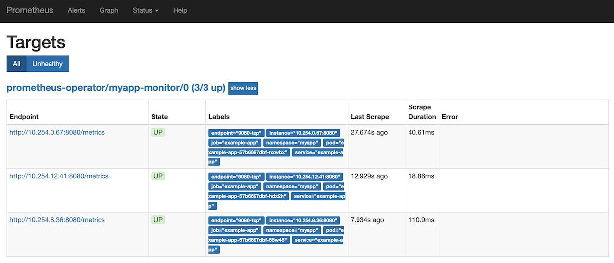
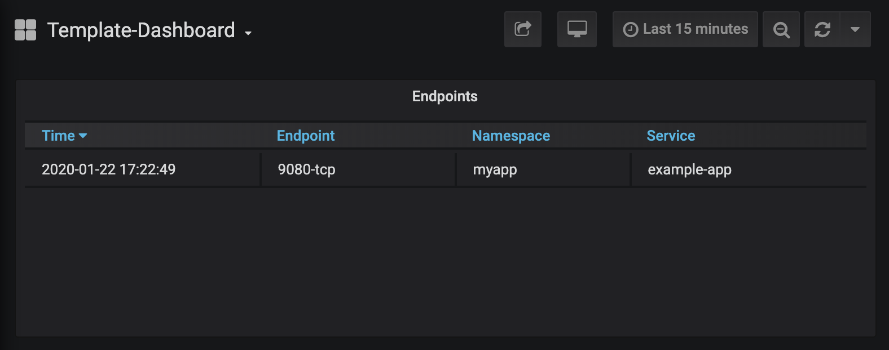

# Application Monitoring on Red Hat OpenShift Container Platform (RHOCP) with Prometheus and Grafana

The following guide has been tested with Red Hat OpenShift Container Platform (RHOCP) 4.2, 4.3, 4.4, 4.5, 4.6 and 4.7, 4.8, 4.9, and 4.10.

## Prerequisites

Prior to installing application monitoring on RHOCP, ensure that there is a running application that has a service endpoint for outputting metrics in Prometheus format.

It is assumed such a running application has been deployed to the RHOCP cluster inside a project/namespace called `myapp`, and that the Prometheus metrics endpoint is exposed on path `/metrics`.

# Application Monitoring on RHOCP 4.6+

In RHOCP 4.6+, application monitoring can be set up by enabling monitoring for user-defined projects without the need to install an additional monitoring solution. This solution will deploy a second Prometheus Operator instance inside the `openshift-user-workload-monitoring` namespace that is configured to monitor all namespaces excluding the `openshift-` prefixed namespaces already monitored by the cluster's default platform monitoring.

There is no separate Grafana deployment that comes with enabling user-defined monitoring and the existing Grafana instance provided with the default monitoring stack is read-only, so a community-powered Grafana Operator must be installed later to create custom dashboards for viewing your metrics.

. To configure the monitoring stack, follow this OpenShift guide link:++https://docs.openshift.com/container-platform/4.10/monitoring/configuring-the-monitoring-stack.html#preparing-to-configure-the-monitoring-stack++[Configuring the monitoring stack]. Here, you will create two config maps, `cluster-monitoring` and `user-workload-monitoring-config`, that will allow you to enable monitoring for user-defined projects in the next step. After creating the `user-workload-monitoring-config` config map, return to this guide to continue setting up monitoring for user-defined projects.

. To enable monitoring for user-defined projects, follow the OpenShift guide link:++https://docs.openshift.com/container-platform/4.10/monitoring/enabling-monitoring-for-user-defined-projects.html++[Enabling monitoring for user-defined projects].

. Deploy a Service Monitor inside the `myapp` namespace to define the service endpoint that will be monitored by the Prometheus instance using the following YAML:

+
[source,yaml]
----
apiVersion: monitoring.coreos.com/v1
kind: ServiceMonitor
metadata:
    name: myapp-monitor
    labels:
        k8s-app: myapp-monitor
    namespace: myapp
spec:
    selector:
        matchLabels:
            app: example-app
    endpoints:
        - interval: 30s
          path: /metrics
          port: 9080-tcp
----
+

. Under Monitoring > Metrics, confirm that your service is being monitored by inserting your own queries specific to your app's metrics.

. To deploy an additional Grafana instance for creating custom dashboards, follow this RedHat blog link:++https://www.redhat.com/en/blog/custom-grafana-dashboards-red-hat-openshift-container-platform-4++[Custom Grafana dashboards for Red Hat OpenShift Container Platform 4]. This Grafana instance will be connected to OpenShift monitoring in the `openshift-monitoring` namespace and additional Grafana dashboards will increase the load on the Prometheus service, so pay attention to Prometheus' CPU and memory usage when deploying dashboards.  

. Deploy the following template Grafana Dashboard link:++https://github.com/OpenLiberty/open-liberty-operator/blob/main/doc/guides-code/grafana_dashboard.yaml.txt++[grafana_dashboard.yaml.txt] to see all the services currently being monitored. Please ensure that the namespace in this yaml is configured to the namespace already deployed.

. Under Networking > Routes, visit Grafana to see the template dashboard. You can now consume all the application metrics gathered by Prometheus on the Grafana dashboard.

# Application Monitoring on RHOCP 4.2-4.5

For application monitoring on RHOCP 4.2-4.5, you need to set up your own Prometheus and Grafana deployments. Both Prometheus and Grafana can be set up via Operator Lifecycle Manager (OLM).

## Deploy Prometheus - Prometheus Operator

The Prometheus Operator is an open-source project originating from CoreOS and exists as a part of their Kubernetes Operator framework. The Kubernetes Operator framework is the preferred way to deploy Prometheus on a Kubernetes system. When the Prometheus Operator is installed on the Kubernetes system, you no longer need to hand-configure the Prometheus configuration. Instead, you create CoreOS ServiceMonitor resources for each of the service endpoints that needs to be monitored: this makes daily maintenance of the Prometheus server a lot easier. An architecture overview of the Prometheus Operator is shown in the following diagram:

image::images/prometheusOperator.png[Prometheus Operator]

Using Operator Lifecycle Manager (OLM), Prometheus operator can be easily installed and configured in RHOCP Web Console.

Use these files while working through the guide:

* link:++guides-code/service_monitor.yaml.txt++[service_monitor.yaml]
* link:++guides-code/service_account.yaml.txt++[service_account.yaml]
* link:++guides-code/prometheus.yaml.txt++[prometheus.yaml]

### Install Prometheus Operator Using Operator Lifecycle Manager (OLM)

The following procedure is based on link:++https://medium.com/faun/using-the-operator-lifecycle-manager-to-deploy-prometheus-on-openshift-cd2f3abb3511[Using the Operator Lifecycle Manager to deploy Prometheus on OpenShift], with the added inclusion of OpenShift commands needed to complete each step.

. Create a new namespace for our Prometheus Operator deployment

+
[source,yaml]
----
oc new-project prometheus-operator
----

. Go to OpenShift Container Platform web console and Click on Operators > OperatorHub. Using the OLM, Operators can be easily pulled, installed and subscribed on the cluster. Ensure that the Project is set to prometheus-operator. Search for Prometheus Operator and install it. Choose prometheus-operator under *A specific namespace on the cluster* and subscribe.

. Click on Overview and create a service monitor instance. A ServiceMonitor defines a service endpoint that needs to be monitored by the Prometheus instance.

. Inside the Service Monitor YAML file, make sure **metadata.namespace** is your monitoring namespace. In this case, it will be prometheus-operator. **spec.namespaceSelector** and **spec.selector** for labels should be configured to match your app deployment's namespace and label. For example, inside the `service_monitor.yaml` file, an application with label **app: example-app** from namespace **myapp** will be monitored by the service monitor. If the metrics endpoint is secured, you can define a secured endpoint with authentication configuration by following the link:++https://github.com/prometheus-operator/prometheus-operator/blob/main/Documentation/api.md#endpoint++[endpoint] API documentation of Prometheus Operator.

. Create a Service Account with Cluster role and Cluster role binding to ensure you have the permission to get nodes and pods in other namespaces at the cluster scope. Refer to the `service_account.yaml` file. Create the YAML file and apply it.
+
[source,sh]
----
oc apply -f service_account.yaml
----

. Click Overview and create a Prometheus instance. A Prometheus resource can scrape the targets defined in the ServiceMonitor resource.

. Inside the Prometheus YAML file, make sure **metadata.namespace** is prometheus-operator. Ensure **spec.serviceAccountName** is the Service Account's name that you have applied in the previous step. You can set the match expression to select which Service Monitors you are interested in under **spec.serviceMonitorSelector.matchExpressions** as in the `prometheus.yaml` file.

. Verify that the Prometheus services have successfully started.
+
[source,sh]
----
[root@rhel7-ocp]# oc get svc -n prometheus-operator
NAME                  TYPE        CLUSTER-IP       EXTERNAL-IP   PORT(S)          AGE
prometheus-operated   ClusterIP   None             <none>        9090/TCP         19h
----

. Check the server logs from one of the target pods to see if the services are running properly.
+
[source,sh]
----
[root@rhel7-ocp]# oc get pods -n prometheus-operator
NAME                                   READY     STATUS    RESTARTS   AGE
prometheus-operator-7fccbd7c74-48m6v   1/1       Running   0          19h
prometheus-prometheus-0                3/3       Running   1          19h
prometheus-prometheus-1                3/3       Running   1          19h
[root@rhel7-ocp]# oc logs prometheus-prometheus-0 -c prometheus -n prometheus-operator
----

. Expose the prometheus-operated service to use the Prometheus console externally.
+
[source,sh]
----
[root@rhel7-ocp]# oc expose svc/prometheus-operated -n prometheus-operator
route.route.openshift.io/prometheus-operated exposed
[root@rhel7-ocp]# oc get route -n prometheus-operator
NAME         HOST/PORT                                                 PATH      SERVICES     PORT      TERMINATION   WILDCARD
prometheus   prometheus-prometheus-operator.apps.9.37.135.153.nip.io             prometheus   web                     None
----

. Visit the Prometheus route and go to the Prometheus targets page.
Check to see that the Prometheus targets page is picking up the target endpoints.

## Deploy Grafana

Use these files while working with Grafana:

* link:++guides-code/grafana_datasource.yaml.txt++[grafana_datasource.yaml]
* link:++guides-code/grafana.yaml.txt++[grafana.yaml]
* link:++guides-code/grafana_dashboard.yaml.txt++[grafana_dashboard.yaml]

Use Grafana dashboards to visualize the metrics. Perform the following steps to deploy Grafana and ensure that Prometheus endpoints are reachable as a data source in Grafana.

. Choose the *same namespace* as Prometheus Operator deployment.
+
[source,sh]
----
oc project prometheus-operator
----

. Go to OpenShift Container Platform web console and click Operators > OperatorHub. Search for Grafana Operator and install it. For **A specific namespace on the cluster**, choose prometheus-operator, and subscribe.

. Click Overview and create a Grafana Data Source instance.

. In the Grafana Data Source YAML file, make sure **metadata.namespace** is prometheus-operator. Set **spec.datasources.url** to the URL of the target datasource. For example, inside the `grafana_datasource.yaml` file, the Prometheus service is **prometheus-operated** on port **9090**, so the URL is set to `http://prometheus-operated:9090`.

. Click Overview and create a Grafana instance.

. In the Grafana YAML file, make sure **metadata.namespace** is prometheus-operator. You can define the match expression to select which Dashboards you are interested in under **spec.dashboardLabelSelector.matchExpressions**. For example, inside the `grafana.yaml` file, the Grafana will discover dashboards with app labels having a value of **grafana**.

. Click Overview and create a Grafana Dashboard instance.

. Copy the `grafana_dashboard.yaml` file to Grafana Dashboard YAML file to check the Data Source is connected and Prometheus endpoints are discoverable.

. Click Networking > Routes and go to Grafana's location to see the template dashboard. You can now consume all the application metrics gathered by Prometheus on the Grafana dashboard.
+

. When importing your own Grafana dashboard, your dashboard should be configured under **spec.json** in Grafana Dashboard YAML file. Make sure under **"__inputs"**, the name matches with your Grafana Data Source's **spec.datasources**. For example, inside the `grafana_dashboard.yaml` file, **name** is set to "Prometheus".

## Configure Prometheus Operator to Detect Service Monitors in Other Namespaces

By default, the Prometheus Operator only watches the namespace it currently resides in, so in order to get the Prometheus Operator to detect service monitors created in other namespaces, you must apply the following configuration changes.

. In your monitoring namespace - in this case, the monitoring namespace is `prometheus-operator` - edit the OperatorGroup to add your application's namespace, for example, `myapp`, to the list of targeted namesaces to be watched. This will change the *olm.targetNamespaces* variable that the Prometheus Operator uses for detecting namespaces to include your `myapp` namespace.
+
[source,sh]
----
oc edit operatorgroup
----
+
[source,sh]
----
spec:
    targetNamespaces:
    - prometheus-operator
    - myapp
----

. Since we have changed the `prometheus-operator` namespace's OperatorGroup to monitor more than one namespace, the operators in this namespace must have the *MultiNamespace* installMode set to *true*. Prometheus Operator installed via OLM has the *MultiNamespace* installMode set to *false* by default, disabling monitoring for more +
+
[source,sh]
----
oc edit csv prometheusoperator.0.32.0
----
+
[source,sh]
----
spec:
installModes:
- supported: true
    type: OwnNamespace
- supported: true
    type: SingleNamespace
- supported: true       # this line should be true
    type: MultiNamespace
- supported: false
    type: AllNamespaces
----
. The same goes for the Grafana Operator, the *MultiNamespace* installMode should be set to *true*. Before editing the Grafana Operator, make sure you have zero Grafana Operator pods running. If you have any Grafana Operator pods running, the Grafana Operator will get stuck in the installation phase when it attempts to reinstall itself with the new *MultiNamespace* installMode. Scale the number of Grafana Operator pods to zero by editing the `replicas` definition in your `grafana-operator` deployment:
+
[source,sh]
----
oc edit deployment grafana-operator 
----
+
[source,sh]
----
spec:
    ...
    replicas: 0     # set this value to 0
----
Once you have zero Grafana Operator pods running, edit the operator using:
+
[source,sh]
----
oc edit csv grafana-operator.v2.0.0 
----
After editing the operator to have the *MultiNamespace* installMode set to true, check to make sure the Grafana Operator has a status of `Succeeded` under the `Installed Operators` page before scaling up the number of Grafana Operator pods again.

. Edit the Prometheus instance to add the *serviceMonitorNamespaceSelector* definition. The empty brackets *{}* allow Prometheus to scrape from *all* namespaces:
+
[source,sh]
----
oc edit prometheuses.monitoring.coreos.com prometheus
----
+
[source,sh]
----
spec:
serviceMonitorNamespaceSelector: {}
----

. Restart the Prometheus Operator and Grafana Operator pods to see the changes.

# Installation Complete

You now have the Prometheus and Grafana stack installed and configured to monitor your applications. Import custom dashboards and visit the Grafana route to see your metrics visualized.
